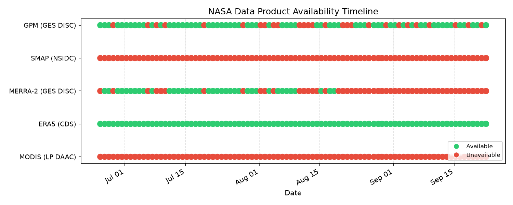

# NASA Data Product Availability Status

*Last checked: 2026-09-03 07:27 UTC*

| Product | Status | Last Checked |
| ------- | ------ | ------------ |
| MODIS (LP DAAC) | ❌ Unavailable | 2026-09-03 07:27 UTC |
| ERA5 (CDS) | ✅ Available | 2026-09-03 07:27 UTC |
| MERRA-2 (GES DISC) | ❌ Unavailable | 2026-09-03 07:27 UTC |
| SMAP (NSIDC) | ❌ Unavailable | 2026-09-03 07:27 UTC |
| GPM (GES DISC) | ✅ Available | 2026-09-03 07:27 UTC |

## Availability Timeline

---
*Generated automatically by the daily-update workflow.*
